# Fitness App — Data Model / ERD Report

This document describes every Django model, its key fields, and all relationships
(ForeignKey / OneToOne / self-references) with `on_delete` behaviour and `related_name`.
Use it as a spec for an AI diagram tool, or import the Mermaid ER diagram at the bottom
straight into **draw.io**.

> **How to get a draw.io diagram from this file:**
> Open draw.io → **`+` (Insert)** → **Advanced → Mermaid…** → paste the `erDiagram`
> block at the end of this file → **Insert**. draw.io renders it as fully editable shapes.
> (Older builds: **Arrange → Insert → Mermaid**.)

---

## Legend

- **PK** primary key (Django auto `id` unless noted)
  - **FK** ForeignKey (many→one)
  - **O2O** OneToOneField (one→one)
  - `on_delete`: **CASCADE** (delete children) / **SET_NULL** (null the link) 
  - *Proxy* models share the parent's table (no own table) — listed for context only.
  - All models inheriting `CreatedBaseModel` also have `created_at`, `updated_at`.

---

## 1. Users & Auth (`apps/models/users.py`)

### User  *(extends Django AbstractUser)*
- `role` — enum: admin / moderator / user
  - (inherits username, password, email, etc.)

### UserProfile  *(CreatedBaseModel)* — central entity, most things hang off it
- **O2O → User** (`CASCADE`, related_name `profile`)
  - `telegram_id` (unique), `name`, `avatar`, `gender`, `birth_date`
  - `weight`, `height`, `experience_level` (beginner/advanced), `fitness_goal`
  - `workout_days_per_week`, `unit_system`, `onboarding_completed`
  - Derived: `is_premium`, `age`, `bmi`

### UserMotivation  *(CreatedBaseModel)*
- **FK → UserProfile** (`CASCADE`, `motivations`)
  - `motivation` (enum); unique_together (user, motivation)

### UserProgram  *(CreatedBaseModel)* — assigns an admin Program to a user
- **FK → UserProfile** (`CASCADE`, `program_assignments`)
  - **FK → Program** (`CASCADE`, `user_assignments`)
  - `is_active`, `assigned_once`

### WorkoutDay
- **FK → UserProgram** (`CASCADE`, `workout_days`)
  - `status`, `order`, `title`, `body_part`, `completed_at`; unique_together (program, order)

### UserProgramExercise
- **FK → WorkoutDay** (`CASCADE`, `exercises`)
  - **FK → Exercise** (`CASCADE`)
  - `sets`, `reps`

---

## 2. Programs / Plans / Workouts (`apps/models/workouts.py`)

### Program  *(CreatedBaseModel)*
- **FK → UserProfile** as `created_by` (`SET_NULL`, `created_programs`)
  - `name` (+ _uz/_ru), `description` (+ _uz/_ru)
  - `type` (admin/auto/custom), `level` (beginner/advanced), `goal` (fat_loss/muscle_gain/recomposition/general)
  - `is_template`, `is_individual`, `is_one_time`, `is_active`, `is_premium`
  - `image`, `workout_type` (gym/home), `share_token`, `view_count`
  - *Proxies:* `IndividualProgram`, `OneTimeProgram`

### Plan  *(CreatedBaseModel)*
- **FK → Program** (`CASCADE`, `plans`)
  - **FK → ProgressionSetting** as `progression_config` (`SET_NULL`)
  - **FK → HomeProgressionSetting** as `home_progression_config` (`SET_NULL`)
  - `name` (+ _uz/_ru), `description`, `order`, `weeks_count`, `is_premium`, `is_4_week`
  - *Proxies:* `Edition`, `GymPlan`, `HomePlan`

### Week
- **FK → Plan** (`CASCADE`, `weeks`)
  - `week_number`; unique_together (plan, week_number)
  - *Proxies:* `GymWeek`, `HomeWeek`

### Workout  *(CreatedBaseModel)*
- **FK → Week** (`CASCADE`, `workouts`)
  - `day_number`, `title` (+ _uz/_ru), `description`, `rounds`, `apply_to_all_weeks`
  - *Proxies:* `GymWorkout`, `HomeWorkout`

### WorkoutExercise
- **FK → Workout** (`CASCADE`, `workout_exercises`)
  - **FK → Exercise** (`CASCADE`, `workout_exercises`)
  - **FK → self** as `source_week_one` (`SET_NULL`, `generated_weeks`) — week-1 seed → generated week copies
  - `sets`, `reps`, `recommended_weight`, `order`, `minutes`

### ProgressionSetting  *(gym progression rules)*
- `key` (unique) + per-week weight/set/rep multipliers, thresholds

### HomeProgressionSetting  *(home progression rules)*
- `key` (unique) + per-week rounds/duration/rest values

### DayTemplate  *(CreatedBaseModel)* — reusable "pre-made day", not bound to a plan
- `name` (+ _uz/_ru), `workout_type`, `rounds`

### DayTemplateExercise
- **FK → DayTemplate** (`CASCADE`, `exercises`)
  - **FK → Exercise** (`CASCADE`, `day_template_exercises`)
  - `sets`, `reps`, `recommended_weight`, `minutes`, `order`

### WorkoutProgress  *(gym progress / completion tracking)*
- **FK → UserProfile** (`CASCADE`)
  - **FK → Workout** (`CASCADE`)
  - `status` (in_progress/completed), `total_calories`, `total_duration_seconds`, `exercises_completed`, `current_exercise_index`, `current_set`

### UserWorkoutProgress  *(home round-based progress)*
- **FK → UserProfile** (`CASCADE`, `home_workout_progresses`)
  - **FK → Workout** (`CASCADE`, `user_progresses`)
  - `current_round`, `current_order`, `is_finished`; unique_together (user, workout)

---

## 3. Exercises (`apps/models/exercises.py`)

### Exercise  *(CreatedBaseModel)*
- `name` (+ _uz/_ru), `description` (+ _uz/_ru)
  - `primary_body_part` (MuscleGroup enum), `thumbnail`, `video`
  - `calory`, `duration`, `recommended_weight`, `workout_type` (gym/home)

### ExerciseInstruction
- **FK → Exercise** (`CASCADE`, `instructions`)
  - `step_number`, `text` (+ _uz); unique_together (exercise, step_number)

---

## 4. Favorites & Custom Programs (`apps/models/favorites.py`)

### FavoriteCollection  *(CreatedBaseModel)*
- **FK → UserProfile** (`CASCADE`, `favorite_collections`)
  - `name`; unique_together (user, name)

### Favorite  *(CreatedBaseModel)*
- **FK → UserProfile** (`CASCADE`, `favorites`)
  - **FK → Exercise** (`CASCADE`, `favorites`)
  - **FK → FavoriteCollection** (`SET_NULL`, `favorites`)
  - **FK → ProgressionSetting** (`SET_NULL`, `favorites`)
  - `sets`, `reps`, `last_performed_weight`, `recommended_weight`, `recommended_weight_week`; unique_together (user, exercise)

### FavoriteExercise  *(CreatedBaseModel)*
- **FK → UserProfile** (`CASCADE`, `favorite_exercises`)
  - **FK → Exercise** (`CASCADE`, `favorited_by_users`); unique_together (user, exercise)

### FavoriteProgram  *(CreatedBaseModel)*
- **FK → UserProfile** (`CASCADE`, `favorite_programs`)
  - **FK → Program** (`CASCADE`, `favorited_by_users`); unique_together (user, program)

### UserCustomProgram  *(CreatedBaseModel)*
- **FK → UserProfile** (`CASCADE`, `custom_programs`)
  - **FK → FavoriteCollection** (`SET_NULL`)
  - `name`, `goal`, `weeks`, `is_active`

### CustomProgramProgress  *(CreatedBaseModel)*
- **FK → UserProfile** (`CASCADE`, `custom_program_progresses`)
  - **FK → UserCustomProgram** (`CASCADE`, `progresses`)
  - `total_calories`, `total_duration_seconds`, `exercises_completed`

---

## 5. Payments / Subscriptions (`apps/models/payments.py`)

### SubscriptionPlan
- `price_uzs`, `price_usd`, `period` (unique: monthly/quarterly/semiannual/yearly), `is_popular`, `is_active`, `order`

### Subscription
- **O2O → UserProfile** (`CASCADE`, `subscription`)
  - **FK → SubscriptionPlan** (`CASCADE`, `subscriptions`)
  - `start_date`, `end_date`, `is_active`

### Payment  *(CreatedBaseModel)*
- **FK → UserProfile** (`CASCADE`, `payments`)
  - **FK → SubscriptionPlan** (`SET_NULL`, `payments`)
  - **FK → Subscription** (`SET_NULL`, `payments`)
  - `status`, `amount`, `currency`, `method`, `is_auto_payment`, `atmos_transaction_id`, Payme/Click fields

---

## 6. Handbook (`apps/models/handbook.py`)

### HandbookCategory  *(CreatedBaseModel)*
- `title` (+ _uz/_ru/_en), `slug` (unique), `description`, `cover_image`, `icon`, `order`, `is_active`

### HandbookSubCategory  *(CreatedBaseModel)*
- **FK → HandbookCategory** (`CASCADE`, `subcategories`)
  - `title`, `slug`, `description`, `image`; unique (category, slug)

### HandbookItem  *(CreatedBaseModel)*
- **FK → HandbookCategory** (`CASCADE`, `direct_items`, nullable)
  - **FK → HandbookSubCategory** (`CASCADE`, `items`, nullable)
  - `title`, `slug`, `short_description`, `description`, `main_image`, `video`, `tags`, `view_count`

---

## 7. Analytics (`apps/models/analytics.py`)

### UserActivity  *(CreatedBaseModel)*
- **FK → UserProfile** (`CASCADE`, `activities`)
  - `event` (enum), `metadata` (JSON)

---

## Mermaid ER Diagram  (paste into draw.io → Insert → Advanced → Mermaid)

```mermaid
erDiagram
    User ||--|| UserProfile : profile

    UserProfile ||--o{ UserMotivation : motivations
    UserProfile ||--o{ UserProgram : program_assignments
    UserProfile ||--o{ Program : created_programs
    UserProfile ||--o{ WorkoutProgress : progress
    UserProfile ||--o{ UserWorkoutProgress : home_progress
    UserProfile ||--o{ FavoriteCollection : favorite_collections
    UserProfile ||--o{ Favorite : favorites
    UserProfile ||--o{ FavoriteExercise : favorite_exercises
    UserProfile ||--o{ FavoriteProgram : favorite_programs
    UserProfile ||--o{ UserCustomProgram : custom_programs
    UserProfile ||--o{ CustomProgramProgress : custom_progress
    UserProfile ||--|| Subscription : subscription
    UserProfile ||--o{ Payment : payments
    UserProfile ||--o{ UserActivity : activities

    Program ||--o{ UserProgram : user_assignments
    Program ||--o{ Plan : plans
    Program ||--o{ FavoriteProgram : favorited_by_users

    UserProgram ||--o{ WorkoutDay : workout_days
    WorkoutDay ||--o{ UserProgramExercise : exercises
    Exercise ||--o{ UserProgramExercise : uses

    ProgressionSetting ||--o{ Plan : gym_rules
    HomeProgressionSetting ||--o{ Plan : home_rules
    Plan ||--o{ Week : weeks
    Week ||--o{ Workout : workouts
    Workout ||--o{ WorkoutExercise : workout_exercises
    Exercise ||--o{ WorkoutExercise : used_in
    WorkoutExercise ||--o{ WorkoutExercise : generated_weeks

    Workout ||--o{ WorkoutProgress : tracked_by
    Workout ||--o{ UserWorkoutProgress : home_tracked_by

    DayTemplate ||--o{ DayTemplateExercise : exercises
    Exercise ||--o{ DayTemplateExercise : used_in

    Exercise ||--o{ ExerciseInstruction : instructions
    Exercise ||--o{ Favorite : favorited
    FavoriteCollection ||--o{ Favorite : favorites
    ProgressionSetting ||--o{ Favorite : rule
    Exercise ||--o{ FavoriteExercise : favorited_by_users
    FavoriteCollection ||--o{ UserCustomProgram : source_collection
    UserCustomProgram ||--o{ CustomProgramProgress : progresses

    SubscriptionPlan ||--o{ Subscription : subscriptions
    SubscriptionPlan ||--o{ Payment : payments
    Subscription ||--o{ Payment : payments

    HandbookCategory ||--o{ HandbookSubCategory : subcategories
    HandbookCategory ||--o{ HandbookItem : direct_items
    HandbookSubCategory ||--o{ HandbookItem : items

    User {
        int id PK
        string username
        string role
    }
    UserProfile {
        int id PK
        int user_id FK
        bigint telegram_id
        string name
        string gender
        date birth_date
        decimal weight
        decimal height
        string experience_level
        string fitness_goal
        string unit_system
        bool onboarding_completed
    }
    UserMotivation {
        int id PK
        int user_id FK
        string motivation
    }
    UserProgram {
        int id PK
        int user_id FK
        int program_id FK
        bool is_active
        bool assigned_once
    }
    WorkoutDay {
        int id PK
        int program_id FK
        string status
        int order
        string title
        string body_part
    }
    UserProgramExercise {
        int id PK
        int day_id FK
        int exercise_id FK
        int sets
        int reps
    }
    Program {
        int id PK
        int created_by_id FK
        string name
        string type
        string level
        string goal
        string workout_type
        bool is_individual
        bool is_one_time
        bool is_premium
        int view_count
    }
    Plan {
        int id PK
        int program_id FK
        int progression_config_id FK
        int home_progression_config_id FK
        string name
        int order
        int weeks_count
        bool is_4_week
    }
    Week {
        int id PK
        int plan_id FK
        int week_number
    }
    Workout {
        int id PK
        int week_id FK
        int day_number
        string title
        int rounds
        bool apply_to_all_weeks
    }
    WorkoutExercise {
        int id PK
        int workout_id FK
        int exercise_id FK
        int source_week_one_id FK
        int sets
        int reps
        float recommended_weight
        int order
        int minutes
    }
    ProgressionSetting {
        int id PK
        string key
    }
    HomeProgressionSetting {
        int id PK
        string key
    }
    DayTemplate {
        int id PK
        string name
        string workout_type
        int rounds
    }
    DayTemplateExercise {
        int id PK
        int day_id FK
        int exercise_id FK
        int sets
        int reps
        int order
    }
    WorkoutProgress {
        int id PK
        int user_id FK
        int workout_id FK
        string status
        float total_calories
        int total_duration_seconds
    }
    UserWorkoutProgress {
        int id PK
        int user_id FK
        int workout_id FK
        int current_round
        bool is_finished
    }
    Exercise {
        int id PK
        string name
        string primary_body_part
        int calory
        int duration
        float recommended_weight
        string workout_type
    }
    ExerciseInstruction {
        int id PK
        int exercise_id FK
        int step_number
        text text
    }
    FavoriteCollection {
        int id PK
        int user_id FK
        string name
    }
    Favorite {
        int id PK
        int user_id FK
        int exercise_id FK
        int collection_id FK
        int progression_setting_id FK
        int sets
        int reps
        float recommended_weight
    }
    FavoriteExercise {
        int id PK
        int user_id FK
        int exercise_id FK
    }
    FavoriteProgram {
        int id PK
        int user_id FK
        int program_id FK
    }
    UserCustomProgram {
        int id PK
        int user_id FK
        int collection_id FK
        string name
        string goal
        int weeks
        bool is_active
    }
    CustomProgramProgress {
        int id PK
        int user_id FK
        int program_id FK
        float total_calories
        int exercises_completed
    }
    SubscriptionPlan {
        int id PK
        decimal price_uzs
        decimal price_usd
        string period
        bool is_popular
        bool is_active
    }
    Subscription {
        int id PK
        int user_id FK
        int plan_id FK
        datetime start_date
        datetime end_date
        bool is_active
    }
    Payment {
        int id PK
        int user_id FK
        int plan_id FK
        int subscription_id FK
        string status
        decimal amount
        string currency
        string method
    }
    HandbookCategory {
        int id PK
        string title
        string slug
        int order
        bool is_active
    }
    HandbookSubCategory {
        int id PK
        int category_id FK
        string title
        string slug
    }
    HandbookItem {
        int id PK
        int category_id FK
        int subcategory_id FK
        string title
        string slug
        int view_count
    }
    UserActivity {
        int id PK
        int user_id FK
        string event
        json metadata
    }
```

---

## Notes / gotchas worth reviewing on the diagram

- **Two parallel progress systems**: `WorkoutProgress` (gym, status-based) and
  `UserWorkoutProgress` (home, round-based) both point at `Workout` + `UserProfile`.
  - **Two "favorite exercise" models**: `Favorite` (rich: sets/reps/weight/collection)
    and `FavoriteExercise` (thin: just user+exercise). Confirm both are still needed.
  - **`WorkoutExercise.source_week_one`** is a self-FK: the week-1 row is the seed,
    weeks 2–6 are generated copies pointing back to it.
  - **Proxy models** (`GymPlan`, `HomePlan`, `GymWeek`, `HomeWorkout`, `IndividualProgram`,
    `OneTimeProgram`, …) do **not** get their own tables — they reuse the base table.
  - **`WorkoutDay` / `UserProgramExercise`** belong to the older `UserProgram` flow, separate
    from the `Program → Plan → Week → Workout` content tree.
